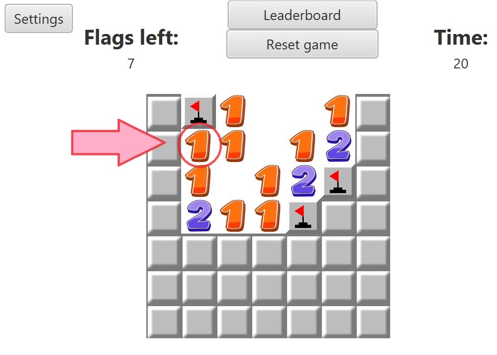
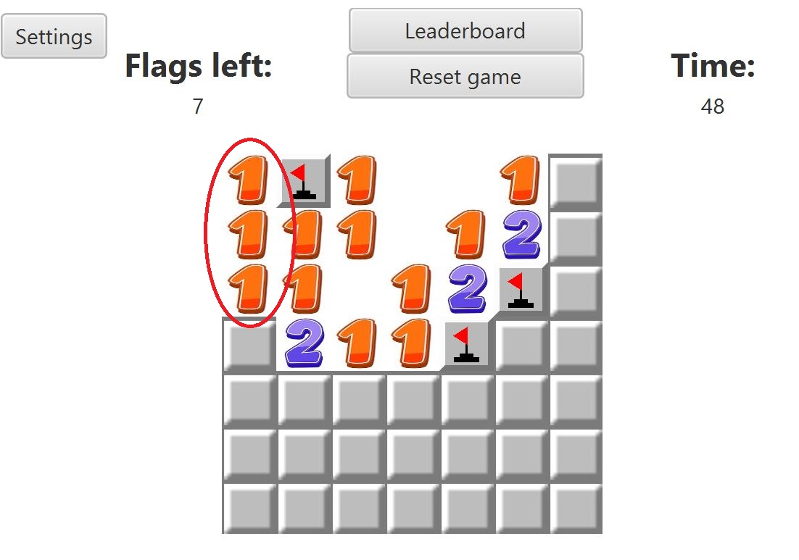

# Minesweeper Project


## Table of Contents 📚

- [Project Description 🕹️](#project-description-🕹️)
- [Project Members 🧔](#members-🧔)
- [Repository Structure 👀](#repository-structure-👀)
- [User story 🧑‍🌾](#user-story🧑‍🌾)
- [How to Run the Game Localy 🚂](#how-to-run-the-game-localy-🚂)
- [How to Run Project in Eclipse Che 🌐](#how-to-run-project-in-eclipse-che-🌐)
- [Game Rules 📜](#game-rules-📜)

## Project Description 🕹️

The goal of the project is to make a working minesweeper game.
More information about the implementation and the environment setup can be found in [Minesweeper README](minesweeper/README.md)

## Members 🧔

- Christian Fredrik Johnsen
- David Tuan Kiet Tran
- Kristian Underdal
- Oskar Emil Wavold

## Repository Structure 👀

- `pictures/`: Contains pictures used in readme-files.
- `docs/`: Contains all sort of documentation about the project, including the reports after each Release.
- `minesweeper/`: This is the folder where all of the code for the Minesweeper-game is.
- `minesweeper/core`: Contains the core logic of the game.
- `minesweeper/rest`: Contains code for running the REST-server and defines the HTTP methods used.
- `minesweeper/ui`: Contains code for frontend UI, created with JavaFX.
- `minesweeper/appdata`: Contains all of the persistent data is. The highscore list is located here.

## User Story🧑‍🌾

We have made a story about Truls who is playing minesweeper.
Truls' adventure can be read here: [user story](docs/release-1/user-story.md)

## How to Run the Game Localy 🚂

1. **Navigate to the minesweeper directory**

```cmd
cd minesweeper
```

2. **Install the code**

```cmd
mvn clean install -U
```

3. **Navigate to the rest module**

```cmd
cd rest
```

4. **Start the REST-server**

```cmd
mvn spring-boot:run
```

5. **Navigate to the ui directory**

Open a new terminal or split your current which is running the server.

```cmd
cd minesweeper\ui
```

6. **Run the application**

```cmd
mvn javafx:run
```

## How to Run Project in Eclipse Che 🌐

1. **Open the link in a browser**

You must have a valid git-token on GitLab and configured a personal access token for Eclipse Che with this git-token.

[Open project in Eclipse Che](https://che.stud.ntnu.no/#https://gitlab.stud.idi.ntnu.no/it1901/groups-2023/gr2302/gr2302?new)

2. **Open a new terminal and navigate to the minesweeper directory**

```cmd
cd minesweeper
```

3. **Run the following command**

The tests are running in a separate window. To see them, do step 7.

```cmd
mvn clean install -U
```

4. **Navigate to the rest module**

```cmd
cd rest
```

5. **Start the REST-server**

```cmd
mvn spring-boot:run
```

6. **Navigate to the ui directory**

Open a new terminal or split your current which is running the server.

```cmd
cd minesweeper\ui
```

7. **Open virtual endpoint**

In the left down corner open **ENDPOINTS** and copy the link from **6080-tcp-desktop-ui (6080/http)** and paste it in a new tab.

8. **Run the following command**

```cmd
mvn javafx:run
```

9. **Navigate to the game**

The game is now running in the other tab with the virtual computer

## Game Rules 📜

You can find the overall rules [here](https://minesweepergame.com/strategy/how-to-play-minesweeper.php).

**Chording**

Chording in this game can be used in a unique way. To use the chording function in this version of Minesweeper, you should first _click on_ a revealed tile. If the number of flags placed around this tile matches the number displayed on the tile itself, you can then _press the spacebar_. This action will open all the surrounding tiles that have not been flagged.

1. **The tile makred with a red circel is clicked**
   
2. **The space bar is cllicked**
   
