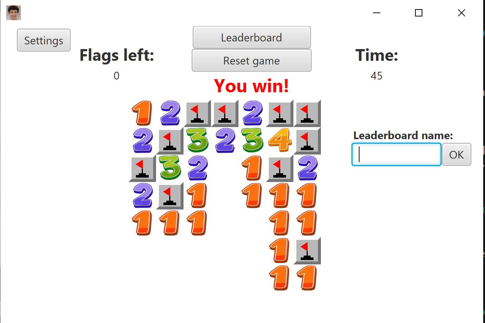
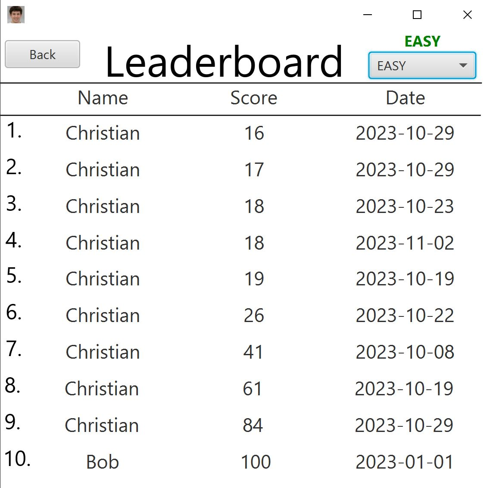
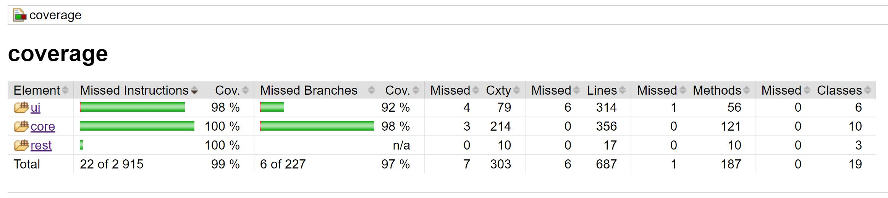
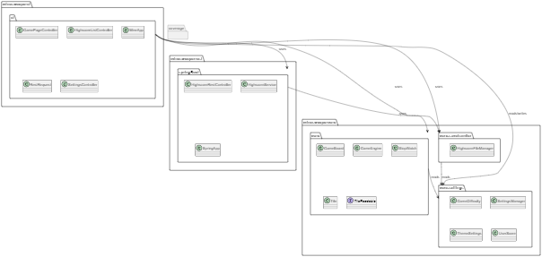

# Minesweeper code base



## Table of contents 📚

- [Table of contents 📚](#table-of-contents-📚)
- [Game Description 🕹️](#game-description-️🕹️)
- [Features 🎈](#features-)
- [Optional Features 🎚️](#optional-features-🎚️)
- [Intended Use 🎮](#intended-use-)
- [Check test coverage🧪](#check-test-coverage🧪)
- [Launch springboot 🚀](#launch-springboot-🚀)
- [Environment setup 🕶️](#environment-setup-️🕶️)
- [Issue Priority Labels 🚩](#issue-priority-labels-🚩)
- [Code Quality Tools 🔨](#code-quality-tools-🔨)
- [Package Diagram 📈](#package-diagram-📈)
- [Modules 📦](#modules-📦)

## Game Description 🕹️

[Minesweeper](<https://en.wikipedia.org/wiki/Minesweeper_(video_game)>) is a puzzle video game created by Microsoft in the 1990's.
The goal of the game is to click on all the cells in the game grid which do not contain bombs.
When you click on a tile, the number of bombs on neighboring tiles is shown.
If you click on a tile which contains a bomb, then you have lost.
Points are given to the player based on how quickly the player was able to clear the grid, by clicking on all non-bomb tiles.

The goal of our project is to make a working version of minesweeper.
A [screenshot](#minesweeper-code-base) of the game is shown at the top of this file.
A picture of how the high-score list might look like is presented below.



## Features 🎈

- **Basic Minesweeper Gameplay**: Clear a grid of tiles without triggering mines.
- **High-Score List**: Players can submit their names and scores after successfully completing a game.

## Optional Features 🎚️

- **Difficulty Levels**: Choose between Easy, Medium, and Hard levels.
- **Game Saving**: Save the current game state and resume later. Note: Saved games will not be eligible for the high-score list to prevent cheating.

## Intended Use 🎮

1. Open the application
2. The main screen is presented
3. Click a button to restart the timer
4. Play the game, and don't lose 😄
5. Submit your name to the high-score list
6. Click the high-score button to view the high-score list

## Check test coverage🧪

**Easily generate and review test coverage** across all modules with the following steps [here](./coverage/README.md#generate-coverage-raport-🧪).

**View Overall Coverage:** For a quick overview of the project's test coverage, refer to the Overall JaCoCo Report below:

**Detailed Module Coverage:** For more comprehensive coverage details of each individual module, check the respective README files in each module directory. These contain detailed JaCoCo coverage reports, offering insights into specific areas of the code.

## Launch springboot 🚀

1. **Navigate to rest**

```cmd
cd rest
```

2. **Run the REST-API**

```cmd
mvn spring-boot:run
```

3. **Kill the server if already running (optional)**

This is only for when you are having issues with the server not auto-closing after use. Run these commands in the **powershell** terminal and follow the instructions:

```cmd
netstat -ano | findstr :8080
```

Replace `<PID-number>` by the value you find from the first command:

```cmd
taskkill /PID <PID-number> /F
```

4. **Go to web browser**
   http://localhost:8080/highscores

## Environment setup 🕶️

- Java: JDK 17
- Maven: Version 3.8.1

## Issue Priority Labels 🚩

To streamline our development process and provide clear guidance on the importance of each task, we use a color-coded labeling system for our GitLab issues. Each color signifies a specific level of priority, detailed as follows:

Green: Optional Features 🟢

- What it means: Issues marked green are considered optional. They are "nice-to-haves" but not essential for the project's core functionality.
- Action: Address these issues only after resolving all higher-priority tasks.

Orange: Medium Priority 🟠

- What it means: Issues marked orange need to be implemented but are not immediate concerns.
- Action: These issues should be addressed in the next release cycle. They take precedence unless there are critical issues that require immediate attention.

Red: High Priority 🔴

- What it means: Issues marked red are critical and must be resolved immediately as they either block further development or introduce serious bugs.
- Action: Prioritize these issues, they must be resolved before attending to tasks of lower priority.

## Code Quality Tools 🔨

- _[SpotBugs](https://spotbugs.github.io/)_: is automatically executed during the build process when running "mvn clean install". It serves to analyze the compiled Java bytecode to detect a variety of potential issues in the code.
- _[Checkstyle](https://checkstyle.sourceforge.io/)_: is helping write Java code that adheres to a coding standard. It automaticly check for miss match in the defined formating in code and [google_checks.xml](./google_checks.xml) and the code when running 'mvn clean install' (the google_checks.xml is [downloaded here](https://github.com/checkstyle/checkstyle/blob/master/src/main/resources/google_checks.xml)).
- _Java-formater_: is a file specified in vscode to automaticly format code. This formating is similar to checkstyle and checkstyle test will pass if this is used. This tool saves a lot of time.
  - [What is Checkstyle?](./FAQ.md#what-is-checkstyle)
  - [How do i standarize my code to pass checkstyle?](./FAQ.md#how-do-i-standarize-my-code-to-pass-checkstyle)
  - [How do i change java-formatter settings?](./FAQ.md#how-do-i-change-java-formatter-settings)

## Convert to executable:

Before doing this, you should first check that the game runs locally by retracing the steps explained [here](../README.md#how-to-run-the-game-localy-🚂). After this, you can follow these steps:

1. **Navigate to minesweeper folder**

```cmd
cd minesweeeper
```

2. **Run the JLink-command**

```cmd
mvn javafx:jlink -f ./ui/pom.xml
```

3. **Run the JPackage-command**

```cmd
mvn jpackage:jpackage -f ./ui/pom.xml
```

4. **Find the executable file**

The executable file should be located in the target folder in ui under "dist". The path from the minesweeper folder is:
`ui\target\dist\MinesweeperFX-1.0.0.exe`

5. **Run the server**

For the executable file to work as intended, the REST-server needs to be running in the background. Retrace the steps [here](#launch-springboot) to complete the set-up.

## Modules 📦

Our project is structured into four distinct modules, each playing a crucial role in our system's functionality. For in-depth information and guidelines on each module, please refer to their individual README files:

1. [ui](ui/readme.md)
2. [rest](rest/readme.md)
3. [coverage](coverage/readme.md)
4. [core](core/readme.md)

## Package Diagram 📈

A diagram showing the connection between the packages in the minesweeper folder


