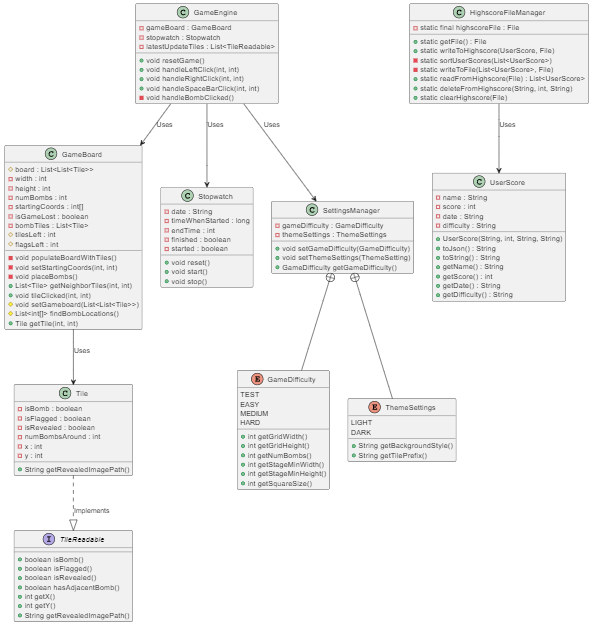

# minesweepercore: Module documentation

The `minesweepercore` module contains the classes containing logic for the minesweeper application. The different classes contained in this module can easily be found in the contents.

## Table of contents

- [Core](#core)
  - [`Tile`](#tile)
  - [`TileReadable`](#tilereadable)
  - [`GameBoard`](#gameboard)
  - [`Stopwatch`](#stopwatch)
  - [`GameEngine`](#gameengine)
  - [`UserScore`](#userscore)
- [settings](#settings)
  - [`GameDifficulty`](#gamedifficulty)
  - [`SettingsManager`](#settingsmanager)
  - [`ThemeSettings`](#themesettings)
- [Savehandler](#savehandler)
  - [`HighscoreFileManager`](#highscorefilemanager)
- [resources](#resources)
- [Class diagram](#class-diagram)
- [Test coverage](#test-coverage)

## Core

This package contains the main classes responsible for the logic needed to have a working minesweeper game.

### `Tile`

This class contains information about the specific tiles populating the minesweeper board. It implements an interface calles TileReadable. It can also return the correct file path for images used in the game.

### `TileReadable`

Interface containing methods for getting various information out of a tile.

### `GameBoard`

Creates a new gameboard populated with tiles after the user has made the first click. It then places the bombs, increments the number on the tiles and reveals tiles following some rules:

1. There cannot be a bomb on the tile clicked or around it.
2. When a bomb has been placed, all the tiles around it should have their number incremented.
3. Every time a tile with no number (zero) is revealed, all the tiles around it should automatically be revealed (it will always be numbers under these).

The class can also handle clicked tiles after the first click has been made and keep track of how many flags and unrevealed tiles are left and if the game is lost.

### `Stopwatch`

The class keeps track of how long the user has played one specific game of minesweeper. This is what the application uses as a score after a game is finished. The time starts at 0 and increments for each second in real time, but can never exceed 999 which is the maximum score.

### `GameEngine`

This is where the minesweeper game is managed. This class keeps track of a GameBoard and a Stopwatch class. The game is predefined to have easy as the deafult difficulty by the SettingsManager class in the settings folder in the same module. This class can handle more user input:

- Left click: Used to reveal a tile
- Right click: Used to place or remove a flag
- Spacebar: Reveals all unrevealed tiles around the tile clicked (must be a number) when the number of flags around this tile match the number on the tile (chording, see game rules).

### `UserScore`

Object representing a highscore-entry. The object contains the name, score, date, and the difficulty level of the game when the score was achieved.

- Methods
  - `toJson()`: Converts the `UserScore` instance to a JSON string.
  - `getName()`, `getScore()`, `getDate()`, `getDifficulty`: Getters for the different fields.

## settings

This folder includes two enums (GameDifficulty and ThemeSettings) and a SettingsManager class.

### `GameDifficulty`

This enum contains all the needed information regarding the three difficulties EASY, MEDIUM and HARD. The information is stored into these constants. The information stored is:

- height/width of the gridpane
- total number of bombs
- the minimum height/width of the stage
- the size of the squares in the gridpane.

### `SettingsManager`

This is where settings in-game are set by using GameDifficulty and ThemeSettings. It stores information about which theme and difficulty is being used. It is also possible to set a new theme and difficulty in this class.

### `ThemeSettings`

An enum containing all the necessary information regarding the themes LIGHT and DARK. The information stored is:

- Background color for the scenes
- Background color for the gridpane
- The prefix used before the image name (used to retrive the correct filepath)

## Savehandler

The saveHandler package handles everything which has to do with data which should be stored. In our app, the only things which need to be stored permanently are the achieved `UserScore` objects.
Functionality for reading, writing and deleting scores from a _JSON_-based highscore file is provided in this package.

### `HighscoreFileManager`

Responsible for manipulation of the JSON-file containing highscore entries.

- Methods
  - `getFile()`: Returns the file used for storing highscores.
  - `writeToHighscore(UserScore userScore, File file)`: Adds a `UserScore` to the highscore file and sorts the scores.
  - `readFromHighscore(File file)`: Reads highscores from a file and returns a list of `UserScore` objects.
  - `deleteFromHighscore(String name, int time, String date)`: Deletes a specific `UserScore` from the file.
  - `clearHighscore(File file)`: Clears all highscores from the file.

## resources

This is the folder where all the images in the game are stored. It contains dark- and lightmode images for tiles, numbers, flags and bombs.

## Class diagram

A diagram showing how the classes in core work together:

## Test coverage

To generate _Jacoco raport_ for the whole project: [here](../coverage/README.md#generate-coverage-raport-🧪).

**Jacoco test coverage core:**

**Jacoco test coverage for all classes in core:**

**Jacoco test coverage for all classes in core.savehandler:**

**Jacoco test coverage for all classes in core.settings:**

