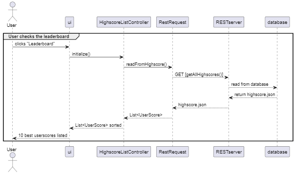

# minesweeperrest: Module documentation

Welcome to the `minesweeperrest` module documentation. This module is an integral part of the Minesweeper game application, providing robust data management functionalities. Its primary focus is to permanently store game scores through a REST-API so that high scores are maintained across sessions, providing an exquisite gaming experience.

The SpringBoot package contains code for the web server's initialization process. It is also responsible for defining which HTTP-requests are supported, and how they are handled.

Use this documentation as a guide for understanding the internal workings of the `minesweeperrest` module.

## Table of contents

- [SpringBoot package](#springboot-package)
  - [Classes](#classes)
    - [`SpringApp`](#springapp)
    - [`HighscoreRestController`](#highscorerestcontroller)
    - [`HighscoreService`](#highscoreservice)
- [Dependencies](#dependencies)
- [Sequence diagram](#sequence-diagram)
- [Test coverage](#test-coverage)

## SpringBoot package

The `springboot` package contains classes for running the spring boot application, and handling the different HTTP-requests which the RESTapi supports.

### Classes

#### `SpringApp`

This is the entry point for the Spring Boot application. It is responsible for firing up the jetty web server.

#### `HighscoreRestController`

This is a REST controller which defines all of the HTTP-requests which are supported. In our case this will be HTTP-requests relating to the highscore list, see [rest documentation](./src/main/java/springboot/REST_DOCUMENTATION.md).

- Endpoints
  - `GET /highscores`: Retrieves all highscores
  - `POST /highscores`: Adds a new highscore entry
  - `DELETE /highscores`: Remove all saved highscores (not yet implemented).

#### `HighscoreService`

A service class which is responsible for the core logic needed to handle the HTTP-requests. The controller class defines which requests the RESTapi supports, and the service class defines how these requests should be processed. The `HighscoreService` class is tightly connected to the `HighscoreFilemanager` class, since all of the HTTP-requests have something to do with manpiulation of the highscore savefile.

- Methods:
  - `getAllHighscores()`: Retrieves all highscores from the save file.
  - `addHighscore(UserScore userScore)`: Adds a new highscore to the save file.
  - `clearAllHighscores()`: Deletes all highscores from the save file.

## Dependencies

- **Jackson Library**: Utilized for JSON processing, enabling easy conversion of `UserScore` objects to/from JSON.
- **Spring Boot**: Automates configuration and startup processes for the web server, simplifies server management and reduces boilerplate code.
- **minesweepercore**: The `HighscoreFileManager`-class from core.savehandler, used to write scores to the JSON-file at the server end.

## Sequence diagram

A diagram showing an important possible sequence in the game

## Test coverage

To generate _Jacoco raport_ for the whole project: [here](../coverage/README.md#generate-coverage-raport-🧪).

**Jacoco test coverage rest:**

**Jacoco test coverage for all classes in :**

